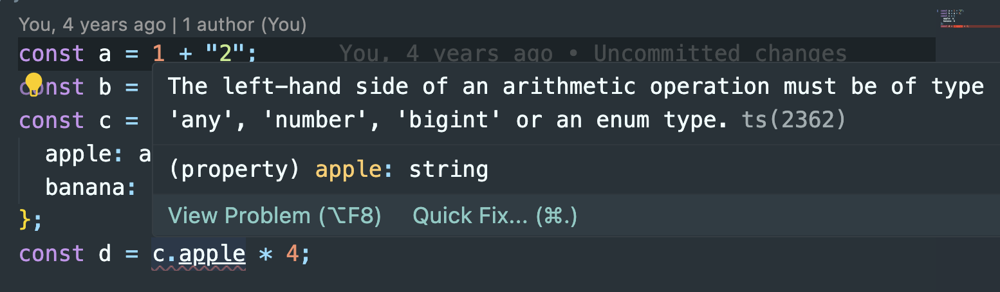

# Ejercicio 2

## Inicio

### Tareas

Error de tipo al usar 'c' antes de tiempo


Error de tipo al usar comillas



### Ventajas del tipado

Como se comento previamente en el apartado 1, hay varias ventajas de usar el tipado.

**Mayor seguridad en los tipos** : evita errores prematuros al combinar variables de distinto tipo, así al ejecutarse nos aseguramos de que obtienen los valores correctos. El tener un dato de un tipo concreto proporciona robusted y confiabilidad al código.

**Autocompletado y refactorización** : p. ej. el code me esta ayudando a completar el código en función del dato que se espara, con opciones validas según su tipo. Adicionalmente se pueden renombrar variables y funciones sin afectar a otras partes del código.

**Documentación** : el código es más facil de documentar y entender por otras personas.

**Menor tiempo de ejecución** : si los errores ya se han filtrado, al ejecutar el programa hay menos posibilidades de que estos aparezcan. Mejor depuración y calidad del código.

**Escalabilidad en grandes proyectos** : el código esta más organizado y es más coherente, lo que ayuda a trabajar en equipo.

## Punto 1. Valores del fichero code2.ts

```
const a = 1042; --> Number
const b = 'apples and oranges'; --> string
const c = 'pineapples'; --> string
const d = [true, true, false]; --> boolean[]
const e = { type: 'ficus' }; --> string (como objeto)
const f = [1, false]; --> (number|boolean)[]
const g = [3]; --> number[], array de números
const h = null; --> null
```

Según el contenido de los elementos así lo asigna, el number tomará los números (valores númericos sin comillas), todo lo que sea una cadena de texto será un string (comillas dobles o sencillas)

El f es tal vez el caso más curioso, ya que puede ser un array de números o de booleanos, dependerá de más datos, false puede ser considerado como cero.

Aunque tenemos arrays (elmentos con corchetes), su tipo sigue siendo boolean o number, pero como array (casos d y g)

Y el null es null. Aquí hay que tener cuidado de también indicarlo al crear la variable en las clases, con un const h = number | null; p. ej. para permitir valores númericos o que sea nulo.

## Punto 2. Errores disparado

Dado el código

```typescript
const i: 3 = 3;
i = 4; // Error TS2588 : Cannot assign to 'i' because it is a constant.ts(2588)

const j = [1, 2, 3];
j.push(4);
j.push("5"); // Error TS2345: Argument of type '"5"' is not assignable to parameter of type 'number'.

let k: never = 4; // Error TSTS2322: Type '4' is not assignable to type 'never'.

let l: unknown = 4;
let m = l * 2; // Error TS2571: Object is of type 'unknown'.
```

No entido muy bien porque me preguntan porque se disparan los errores, si ya están en el código.

1. Una constante no puede cambiar de valor.
2. Si es un tipo numero no se pueden asignar valores de tipo string (con '')
3. never es un tipo especial que representa un valor que nunca ocurre, no se le puede asignar un número.
4. Si definimos una variable con unknow no se puede mezclar con números, se usa mas para cuando no se conoce el tipo de variable, es similar al any, solo que este permite ambigüedad.

## Punto 3. Clave vs. Interfaz

Básicamente la interfaz es una declaración de la estructura del contenido. La clase, igual más toda su lógica. Lo extiendo:

- **Interfaz**: es una forma de definir la estructura de un objeto (el esqueleto). Las interfaces solo se utilizan para contener la información de tipo de varios atributos correspondientes a un objeto. Generalmente se usa para la verificación de tipos y, por lo tanto, para evitar errores de tiempo de ejecución y no se puede usar para la creación de instancias de objetos
- **Clase**: es una plantilla para crear objetos y puede contener propiedades y métodos. Las clases pueden tener propiedades inicializadas y tener implementaciones de varios métodos dentro de ellas. Las clases se utilizan para crear instancias de objetos
